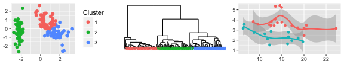
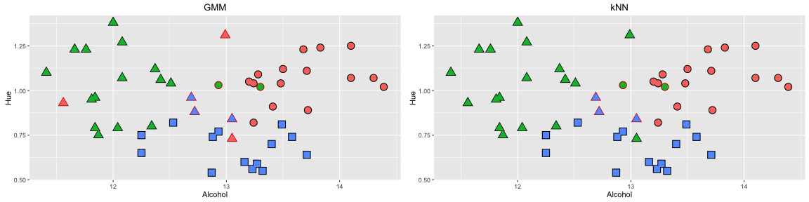
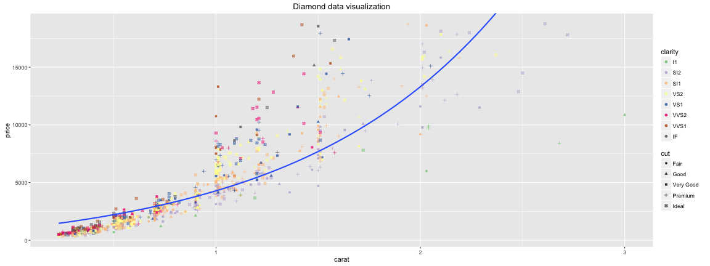

Data Analytics with R
========================================================
author: ircus
date: May 14, 2016

Data Analysis Workflow
========================================================

* Getting data

 
 
 
 
 
...

* Analysis



* Presentation

 
 
 


Retrieving and formatting data
========================================================

* Relational databases (<span style="color:steelblue">_ROracle_</span>, <span style="color:steelblue">_RMySQL_</span>, <span style="color:steelblue">_RSQLite_</span>, <span style="color:steelblue">_RPostgreSQL_</span>)
* Document databases (<span style="color:steelblue">_rmongodb_</span>, <span style="color:steelblue">_RMongo_</span>)
* Graph databases (<span style="color:steelblue">_RNeo4j_</span>)
* Key-value databases (<span style="color:steelblue">_rredis_</span>)
* Column databases (<span style="color:steelblue">_RCassandra_</span>, <span style="color:steelblue">_rhbase_</span>)
* &rarr; data.frame (<span style="color:steelblue">_plyr_</span>, <span style="color:steelblue">_tidyr_</span>, <span style="color:steelblue">_reshape2_</span>, <span style="color:steelblue">_lubridate_</span>)
* &rarr; graph.data.frame (<span style="color:steelblue">_igraph_</span>), network (<span style="color:steelblue">_sna_</span>)


```
IGRAPH DN-- 3 2 -- 
+ attr: name (v/c), age (v/n)
+ edges (vertex names):
[1] Bob  ->Alice Cecil->Bob  
```

Data analysis
========================================================

* Leading language in scientific community &rarr; large number of packages that supply algorithms coming from various scientific domains 
* Machine learning: <span style="color:steelblue">_stats_</span>, <span style="color:steelblue">_caret_</span> (outlier detection, model fitting, clustering)
* Linguistics: <span style="color:steelblue">_lda_</span> (topic modelling), <span style="color:steelblue">_NLP_</span>, <span style="color:steelblue">_openNLP_</span>
* Networks (graphs): <span style="color:steelblue">_sna_</span> (neighborhoods, shortest paths, etc.)



Visualization and analysis delivery
========================================================

* <span style="color:steelblue">_ggplot2_</span> - one of the best static visualization packages in R
* <span style="color:steelblue">_rCharts_</span> - adds interactivity to ggplots
* <span style="color:steelblue">_venneuler_</span>, <span style="color:steelblue">_VennDiagram_</span> - venn diagrams
* <span style="color:steelblue">_shiny_</span> - embed interactive components in reports to manipulate plotted data or implement shareable applications (such as [Logging Statistics](https://ircus.shinyapps.io/loggingStats/))


